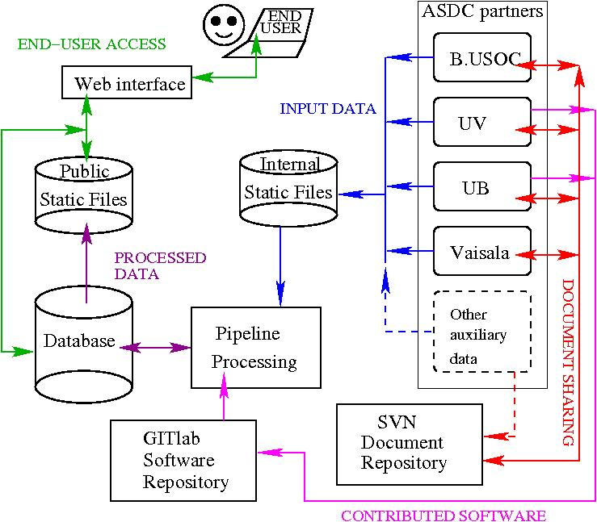
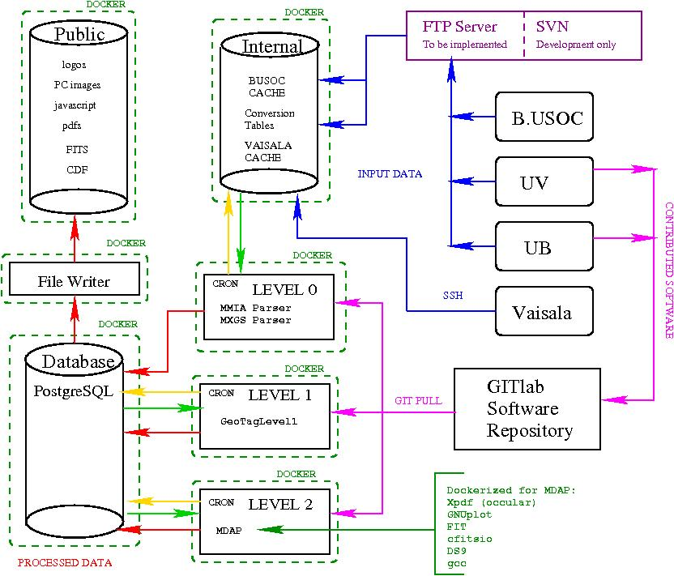

## ASDC Software, Structure, Improvements, Known Bugs
Gareth Murphy


---

### ASDC pipeline 
- The pipeline is written in Python 3
- MDAP (MXGS Data Analysis Program) written in C++ (Paul Connell)
- UB software contributed in Matlab
- Telemetry types are implemented as Django models


---


---

---

---

---

---

---
### Illustrative example of telemetry

```
class MXGSTGFObservation(ASIMBase):
    observation_id = models.IntegerField('Observation ID')
    utc_year = models.PositiveSmallIntegerField('UTC year')
    utc_seconds = models.PositiveIntegerField('UTC seconds')
    utc_msec = models.PositiveSmallIntegerField('UTC msec')
    tcp_count_dhpu = models.PositiveIntegerField()
    tcp_count_dpu = models.PositiveIntegerField()
    dpu_count = models.PositiveIntegerField()
    dpu_count_prereset = models.IntegerField()
    dau_bgo_1_int_tmon_chan1 = models.PositiveSmallIntegerField()
    dau_bgo_1_int_tmon_chan2 = models.PositiveSmallIntegerField()
    dau_bgo_1_int_tmon_chan3 = models.PositiveSmallIntegerField()
    dau_bgo_1_int_tmon_chan4 = models.PositiveSmallIntegerField()
    dau_bgo_2_int_tmon_chan1 = models.PositiveSmallIntegerField()
    dau_bgo_2_int_tmon_chan2 = models.PositiveSmallIntegerField()
    dau_bgo_2_int_tmon_chan3 = models.PositiveSmallIntegerField()
    dau_bgo_2_int_tmon_chan4 = models.PositiveSmallIntegerField()
    dau_bgo_3_int_tmon_chan1 = models.PositiveSmallIntegerField()
```
---
### Structure

- Divided into level0,1,2
- subdivided into SRD packages
- Each software requirement has its own directory

---
### Level 0

---

### Example software requirement

- 3.1.4 The ASDC shall output all chosen data formats for all processing levels
The formats are: FITS format [4] and NASA CDF format [3].
-  Implementation: Filewriter

---
### Implementation:
```
class CDFWriter(FilewriterBase):
    def write_cdf(self, my_tgf):
        self.observation_dict = model_to_dict(my_tgf)
        self.set_file_name()
        self.write_dict_to_cdf(self.observation_dict)

    def write_dict_to_cdf(self, my_tgf_dict):
        self.set_file_name()
        print(self.file_name)
        self.remove_file()
        pycdf.lib.set_backward(False)
        cdf = pycdf.CDF(self.file_name, '')
        for key, val in my_tgf_dict.items():
            if key not in self.invalid_keys:
                if val is None:
                    val = [0]
                cdf_type = self.determine_cdftype(key, val)

                if isinstance(val, list):
                    cdf_type = self.determine_cdftype(key, max(val))

                if cdf_type is not None:
                    print(cdf_type)
                    cdf.new(key, val, recVary=False, type=cdf_type)
                else:
                    cdf.new(key, val, recVary=False)

        cdf.attrs['Author'] = 'Gareth Murphy <gmurphy@space.dtu.dk>'
        cdf.attrs['CreateDate'] = datetime.datetime.now()
        # print(cdf.attrs)
        cdf.close()
```


---
### Known bugs

- CDF library uses  smallest available type, depending on value
- Fix: manually alter type

---
### Example Requirement: TGF Parser

- 3.1.1 The ASDC shall archive and process all data packets received from the B.USOC
The format will be in the CCSDS space telemetry packet format [2].
- Implementation: MXGSTGFObservationParser()
---
```
class MXGSTGFObservationParserText():
    def __init__(self):
        self.address = MXGSAddress()

    def unpack_and_sort(self, bgo_format, bgo_data, time_of_photon_hit):
        bit_formatted_bgo_list = [BitArray(bin=y) for y in bgo_data]
        unpack_tuple_list = (
            [x.unpack(bgo_format) for x in bit_formatted_bgo_list])
        unpack_sort = sorted(unpack_tuple_list, key=lambda x: x[time_of_photon_hit])
        return unpack_sort

    def parse(self, masterdata, obsid):
        mxgstgfobservation = MXGSTGFObservation()
        x = iter(masterdata)


        mxgstgfobservation.observation_id = int(obsid, 16)
        mxgstgfobservation.utc_year = hex2int(next(x))
        mxgstgfobservation.utc_msec = hex2int(next(x))
        mxgstgfobservation.utc_seconds = hex2int(next(x) + next(x))
        mxgstgfobservation.tcp_count_dhpu = hex2int(next(x) + next(x))
        mxgstgfobservation.tcp_count_dpu = hex2int(next(x) + next(x))
        mxgstgfobservation.dpu_count = hex2int(next(x) + next(x))
        mxgstgfobservation.dpu_count_prereset = hex2int(next(x) + next(x))
        mxgstgfobservation.dau_bgo_1_int_tmon_chan1 = hex2int(next(x))
        mxgstgfobservation.dau_bgo_1_int_tmon_chan2 = hex2int(next(x))
        mxgstgfobservation.dau_bgo_1_int_tmon_chan3 = hex2int(next(x))
        mxgstgfobservation.dau_bgo_1_int_tmon_chan4 = hex2int(next(x))
        mxgstgfobservation.dau_bgo_2_int_tmon_chan1 = hex2int(next(x))
        mxgstgfobservation.dau_bgo_2_int_tmon_chan2 = hex2int(next(x))
        mxgstgfobservation.dau_bgo_2_int_tmon_chan3 = hex2int(next(x))
        mxgstgfobservation.dau_bgo_2_int_tmon_chan4 = hex2int(next(x))
        mxgstgfobservation.dau_bgo_3_int_tmon_chan1 = hex2int(next(x))
        mxgstgfobservation.dau_bgo_3_int_tmon_chan2 = hex2int(next(x))
        mxgstgfobservation.dau_bgo_3_int_tmon_chan3 = hex2int(next(x))
        mxgstgfobservation.dau_bgo_3_int_tmon_chan4 = hex2int(next(x))
        mxgstgfobservation.dau_bgo_4_int_tmon_chan1 = hex2int(next(x))
        mxgstgfobservation.dau_bgo_4_int_tmon_chan2 = hex2int(next(x))
        mxgstgfobservation.dau_bgo_4_int_tmon_chan3 = hex2int(next(x))
        mxgstgfobservation.dau_bgo_4_int_tmon_chan4 = hex2int(next(x))
        mxgstgfobservation.led_short_win_lr_pulse_height = hex2int(next(x))
        mxgstgfobservation.led_short_win_upr_pulse_height = hex2int(next(x))
        mxgstgfobservation.led_long_win_lr_pulse_height = hex2int(next(x))
        mxgstgfobservation.led_long_win_upr_pulse_height = hex2int(next(x))
        mxgstgfobservation.hed_short_win_lr_pulse_height = hex2int(next(x))
        mxgstgfobservation.hed_short_win_upr_pulse_height = hex2int(next(x))
        mxgstgfobservation.hed_long_win_lr_pulse_height = hex2int(next(x))
        mxgstgfobservation.hed_long_win_upr_pulse_height = hex2int(next(x))

        shortlongwin = next(x)
        mxgstgfobservation.led_short_win_anticoin_time = hex2int(shortlongwin[0:2])
        mxgstgfobservation.led_long_win_anticoin_time = hex2int(shortlongwin[2:4])
        shortlongwin = next(x)
        mxgstgfobservation.hed_short_win_anticoin_time = hex2int(shortlongwin[0:2])
        mxgstgfobservation.hed_long_win_anticoin_time = hex2int(shortlongwin[2:4])

        bits = next(x)

        a = BitArray('0x' + bits)
        mxgstgfobservation.led_short_win_flag1 = a[0]
        mxgstgfobservation.led_short_win_flag2 = a[1]
        mxgstgfobservation.led_short_win_flag3 = a[2]
        mxgstgfobservation.led_long_win_flag = a[3]
        mxgstgfobservation.hed_short_win_flag1 = a[4]
        mxgstgfobservation.hed_short_win_flag2 = a[5]
        mxgstgfobservation.hed_short_win_flag3 = a[6]
        mxgstgfobservation.hed_long_win_flag = a[7]

        mxgstgfobservation.trig_mmia_enabled = a[8]
        mxgstgfobservation.trig_mmia_recd = a[9]
```
---
### Known bugs:
- Time order can be non-sequential
- Most significant digit is missing from time
---
### Docker 
- Pipeline runs on lightweight containers
- Software installation requirements stored as Dockerfiles


```
FROM ubuntu:16.04
MAINTAINER Gareth Murphy <gmurphy@space.dtu.dk>
RUN mkdir /code
WORKDIR /code
RUN apt-get update && apt-get install -y \
        cron \
        curl \
        gfortran \
        libncurses5-dev \
        libpq-dev \
        python3-astropy \
        python3-matplotlib \
        python3-numpy \
        python3-pip \
        python3-scipy \
        python3-ephem
COPY requirements.txt /code/
```

---
## Using the docker containers

To start the docker project you must first clone the repository

```
git clone https://gitlab.spacecenter.dk/asdc/asdc.git
```

```
docker-compose up --build
```

To log into individual container use the command 
```
docker exec -it <CONTAINER_NAME> /bin/bash 
```


where ```<CONTAINER_NAME>``` is one of:


asdc_level0_1 , asdc_level1_1 , asdc_level3_1 , asdc_web_1 , asdc_db_1 , asdc_filewriter_1
---
E.g. to run migrations use:

```
docker exec -it asdc_web_1 /bin/bash 
```

Then run

```
./manage.py makemigrations
./manage.py migrate
```

To access level0 scripts and functions
```
docker exec -it asdc_level0_1 /bin/bash 
 ```

Similarly for level1 
```
docker exec -it asdc_level1_1  /bin/bash 
```
---
1. Start a shell session in level0 container
```
docker exec -it dtuspaceasdcbuild_level0_1 /bin/bash
```

2. Run the level0 script
```
./RunLevel0
```
(To restore Pacts data run ./RunLevel0Pacts)

3. Start a shell session in level1 container
```
docker exec -it dtuspaceasdcbuild_level1_1 /bin/bash
```

4. Run the level1 script
```
./RunLevel1
```


---

### TLE forms

- TLE community can submit observations


---
### Improvements

- Need to add on-board and on-ground processing from CE TN
- 
---
### Known Bugs

- Fails when unexpected packet is received
- Packet sequences with gaps are not processed

---
THANKS
